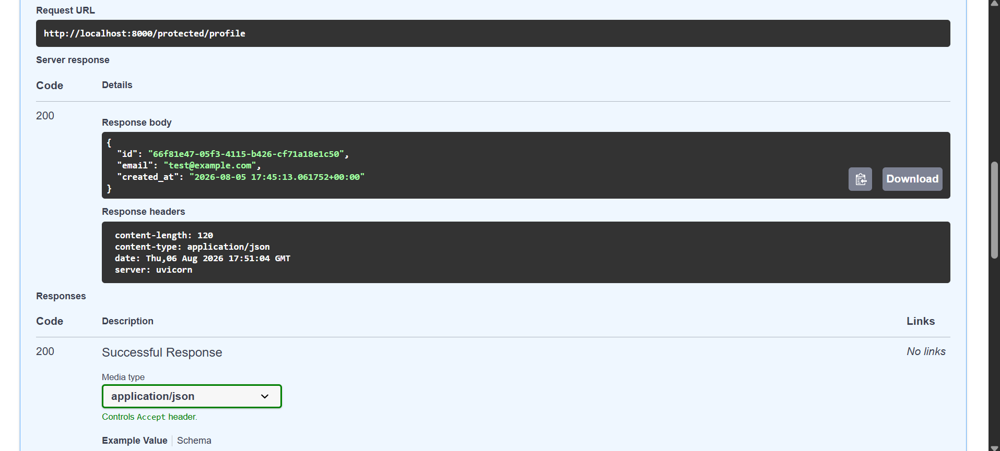

# Task API

A CRUD Task API built across four stages of the FlyRank Backend Internship:

1. **A1** — in-memory CRUD API (FastAPI)
2. **A2** — storage moved to SQLite (persists across restarts)
3. **A3** — storage moved to Postgres, running in Docker, orchestrated with Docker Compose
4. **A4** — added Supabase Auth: signup, login, logout, JWT verification, and protected routes

Each stage kept the exact same task endpoints and behavior. The storage layer and, later, an authentication layer were added on top — that's the whole point of the assignment.

---

## Endpoints

### Tasks (unauthenticated, unchanged since A1)

| Method | Path | Description |
|---|---|---|
| GET | `/` | API info |
| GET | `/health` | Health check |
| GET | `/tasks` | List tasks (supports `?done=` and `?search=`) |
| GET | `/tasks/{id}` | Get a single task |
| POST | `/tasks` | Create a task |
| PUT | `/tasks/{id}` | Update a task |
| DELETE | `/tasks/{id}` | Delete a task |
| GET | `/stats` | Task counts (total / done / open) |

### Auth (new in A4)

| Method | Path | Auth Required | Description |
|---|---|---|---|
| POST | `/auth/signup` | No | Create a new user account via Supabase Auth |
| POST | `/auth/login` | No | Log in, returns access token + refresh token |
| POST | `/auth/logout` | Yes (Bearer) | End the current session |
| GET | `/public/info` | No | Open, unauthenticated sample route |
| GET | `/protected/profile` | Yes (Bearer) | Returns the logged-in user's id, email, created_at |
| GET | `/protected/dashboard` | Yes (Bearer) | Second protected route — proves the guard is reusable |

Status codes: `200` success, `201` created, `204` no content (delete/logout), `400` invalid body, `401` missing/invalid/expired token, `404` not found.

---

## Stack

- **FastAPI** — routes and app logic
- **Postgres 16** — task storage, running in Docker
- **Supabase Auth** — Identity Provider: stores accounts, hashes passwords, issues and verifies JWTs
- **Docker Compose** — runs app + database together with one command
- **psycopg2** — Postgres driver
- A `TaskRepository` interface (`repository.py`) with a Postgres implementation (`postgres_repository.py`) — routes never touch SQL directly

---

## Running it

Requires **Docker Desktop** installed and running. Nothing else needs to be installed manually — Postgres, the app, and all Python dependencies are handled inside the containers.

```bash
docker compose up --build
```

This will:
- Pull the Postgres 16 image and start it with a persistent volume (`pgdata`)
- Run `init.sql` automatically on first start — creates the `tasks` table and seeds 3 example tasks (only if the table is empty)
- Build the FastAPI app image and install its dependencies (including the Supabase SDK)
- Start both containers together, app depending on the database

Once running:
- API: `http://localhost:8000`
- Interactive docs (Swagger UI): `http://localhost:8000/docs`
- List tasks: `http://localhost:8000/tasks`

To stop everything (keeping data):
```bash
docker compose down
```

To wipe the database completely (danger — deletes all data):
```bash
docker compose down -v
```

---

## Environment variables

Connection details and secrets live in `.env`, which is **gitignored** and never committed. A `.env.example` is committed instead, showing the expected shape without real credentials.

To run locally, copy the example and fill in your own values:
```bash
cp .env.example .env
```

`.env` contains:
```
DATABASE_URL=postgresql://taskuser:taskpass@db:5432/taskdb
SUPABASE_URL=your_supabase_project_url
SUPABASE_KEY=your_supabase_anon_key
```

`SUPABASE_URL` and `SUPABASE_KEY` come from your own Supabase project — Project Settings → Data API for the URL, and Settings → API Keys (anon/public key) for the key. Never use the `service_role` key here; it bypasses all security and must stay server-side/secret.

---

## Authentication flow (A4)

Supabase acts as the Identity Provider — it stores accounts, hashes passwords, and signs JWTs. This API never handles raw passwords or writes any cryptography itself.

1. Client signs up or logs in via `/auth/signup` or `/auth/login`, sending email + password.
2. Supabase validates the credentials and returns a JWT **access token** (plus a refresh token).
3. Client sends that token on every protected request: `Authorization: Bearer <token>`.
4. The server verifies the token with Supabase (`supabase.auth.get_user(token)`) before running the route. A missing, malformed, tampered, or expired token returns `401`.

The verification logic lives in a single reusable dependency (`get_current_user`) in `auth.py`, applied to `/protected/profile`, `/protected/dashboard`, and `/auth/logout` — no route duplicates the token-checking logic.

### Swagger UI

Interactive docs with bearer-token authorization are available at `/docs`. Click **Authorize**, paste an access token obtained from `/auth/login`, and try any protected route directly from the browser — no curl needed.



---

## Architecture: why the task routes never changed

`main.py` only calls methods on a `TaskRepository` interface (`repository.py`):

```python
repo = PostgresTaskRepository()
...
return repo.get_all(done=done, search=search)
```

`postgres_repository.py` implements that interface using real SQL against Postgres. Earlier, the exact same interface was implemented against SQLite (A2) and, before that, an in-memory list (A1).

**Nothing in `main.py`'s task route logic changed between A1 → A2 → A3 → A4.** Storage and auth were added as separate concerns — the task API is a promise, the repository is where that promise gets kept, and `auth.py` is a separate door bolted onto the same house.

---

## Database schema

```sql
CREATE TABLE IF NOT EXISTS tasks (
    id SERIAL PRIMARY KEY,
    title TEXT NOT NULL,
    done BOOLEAN NOT NULL DEFAULT false
);
```

Seeding (3 example tasks) only happens if the table is empty — checked with `WHERE NOT EXISTS (SELECT 1 FROM tasks)` in `init.sql`. This runs automatically the first time the Postgres container initializes its data volume; it does **not** re-run or duplicate seeds on normal restarts, because the volume already has data.

User accounts (email, hashed password, JWT signing) are managed entirely by Supabase — no user table exists in this project's own Postgres database.

---

## Proving persistence

Persistence was verified two ways:

**1. Via the API, across a full container teardown:**
```bash
# create a task
curl -X POST http://localhost:8000/tasks -H "Content-Type: application/json" -d '{"title":"test persistence"}'

# confirm it's there
curl http://localhost:8000/tasks

# stop everything (containers removed, volume kept)
docker compose down

# start again
docker compose up

# confirm the task survived
curl http://localhost:8000/tasks
```
The task created before `docker compose down` was still present after `docker compose up` restarted both containers from scratch. This works because `pgdata` is a **named Docker volume** — `docker compose down` (without `-v`) removes containers but keeps the volume attached to disk.

**2. Directly in Postgres, bypassing the API:**
```bash
docker exec -it todo-api-db-1 psql -U taskuser -d taskdb
```
```sql
SELECT * FROM tasks;
```
Rows matched exactly what the API returned — confirming there's a single source of truth and no separate in-memory state hiding anywhere.

---

## Stage history

| Stage | Focus | What changed |
|---|---|---|
| A1 | Python list in memory | Baseline CRUD API |
| A2 | SQLite (`tasks.db`) | Storage moved to a real database file; routes untouched |
| A3 | Postgres in Docker | Storage moved to a networked database; routes still untouched; app containerized |
| A4 | Supabase Auth | Added signup/login/logout, JWT verification, protected routes, reusable auth dependency, Swagger bearer auth |

### Why SQLite was chosen for A2
Single file, zero setup, no server process to install or manage — ideal for proving the memory-to-disk persistence concept before adding real infrastructure.

### Why Postgres for A3
Matches what a real production backend uses — a proper server-based database that can handle concurrent connections, runs identically on any machine via Docker, and is the natural next step once SQLite's single-file model isn't enough.

### Why Supabase for A4
Rolling your own password hashing and token signing is a common source of real-world security breaches. Supabase is a trusted Identity Provider — it hashes passwords, signs JWTs, and exposes a simple SDK, so the API's own code only ever handles verifying tokens, never storing secrets.

---

## Local development notes

- All SQL uses parameterized queries (`%s` placeholders with psycopg2) — no string-glued SQL anywhere, protecting against SQL injection.
- `docker-compose.yml` mounts `init.sql` into Postgres's `/docker-entrypoint-initdb.d/` folder, which Postgres's official image auto-executes exactly once, only against a fresh (empty) volume.
- `tasks.db` (from the A2 SQLite stage) and `.env` are both gitignored; only `.env.example` and the SQL/Docker config are committed.
- The Supabase **anon** key is used (safe to expose client-side); the `service_role` key is never used in this project.

---

## Example: one SQL query run by hand

```sql
SELECT * FROM tasks WHERE done = true;
```
Returned all tasks marked complete — confirming the `done` boolean column and seed data were set up correctly.